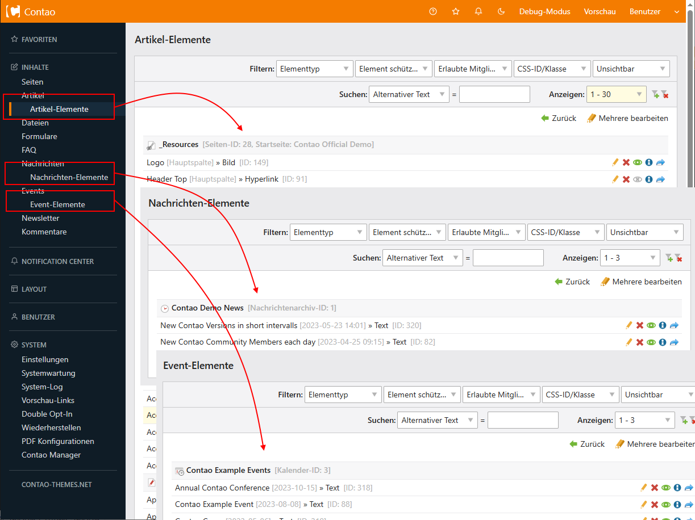

Contao Extension: DirectContentElements
=======================================

Directly lists all content elements of articles, news and events.

Provides the possibility to edit content elements across parent containers (multi-editing).

Installation
------------

Install the extension via composer: [cliffparnitzky/direct-content-elements](https://packagist.org/packages/cliffparnitzky/direct-content-elements).

If you prefer to install it manually, download the latest release here: https://github.com/cliffparnitzky/DirectContentElements/releases

Tracker
-------

https://github.com/cliffparnitzky/DirectContentElements/issues

Compatibility
-------------

- Contao version >= 4.4.0

Dependency
----------

There are no dependencies to other extensions, that have to be installed.

Screenshots
-----------

